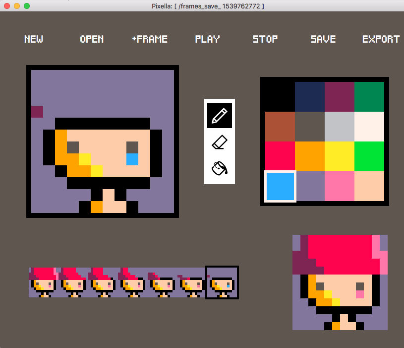

# PixelArtApp

A pixel art animation editor written in C++ and Qt, inspired by the PICO-8 fantasy console editor.



## What it can do

The editor (window title **Pixella**) is a small 12×12 pixel animation studio:

- **Draw on a 12×12 canvas.** Click and drag to paint pixels. The canvas uses a peach default background (`#FFF1E8`).
- **Pen, eraser, and fill.** The pen paints with the selected palette color. The eraser restores pixels to the default background. Fill flood-fills a connected region of the same color.
- **16-color palette.** A fixed PICO-8-style 4×4 swatch grid; click a color to use it with the pen and fill tools.
- **Multi-frame animation.** **+FRAME** duplicates the current frame and appends it. A filmstrip along the bottom shows thumbnails (up to 8); click one to edit that frame.
- **Playback.** **PLAY** and **STOP** preview the sequence on a larger movie screen at one second per frame, looping from the start.
- **Projects.** **NEW** starts a blank one-frame animation. **SAVE** writes frames and colors to a JSON file. **OPEN** loads a saved project. The last opened file is remembered and restored on launch.
- **Export.** **EXPORT** captures the canvas as a PNG (`Pixella_image_<timestamp>.png`).

## How to run

This is a Qt Widgets app built with **qmake** (`Drawing.pro`). It needs Qt 5 (Widgets module) and a C++11 compiler. It was originally built with Qt 5.11.1 in Qt Creator.

### Qt Creator

1. Install [Qt](https://www.qt.io/download) with the Qt 5 Widgets module and Qt Creator.
2. Open `Drawing.pro`.
3. Choose a desktop kit, then **Build** and **Run**.

The binary is named `Drawing`.

### Command line

```bash
qmake Drawing.pro
make
./Drawing
```

On Windows, use `nmake` or `mingw32-make` instead of `make`, then run `Drawing.exe`.

## License

MIT — see [LICENSE](LICENSE).
